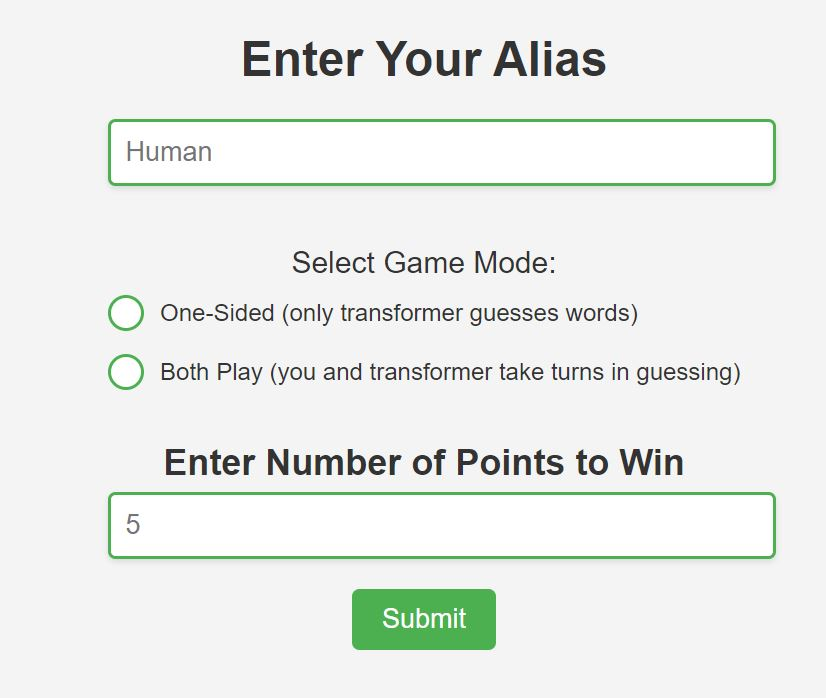
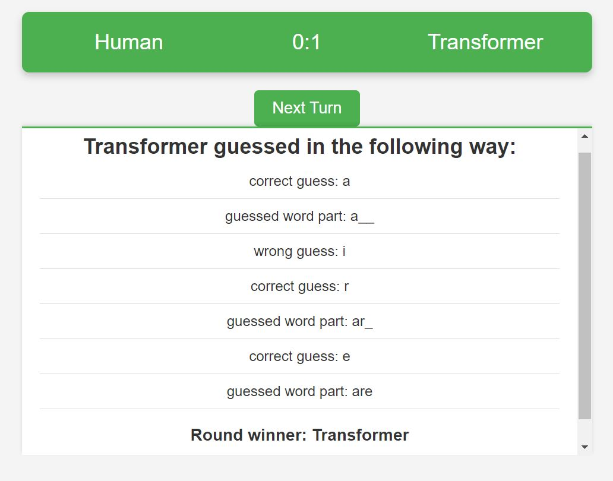
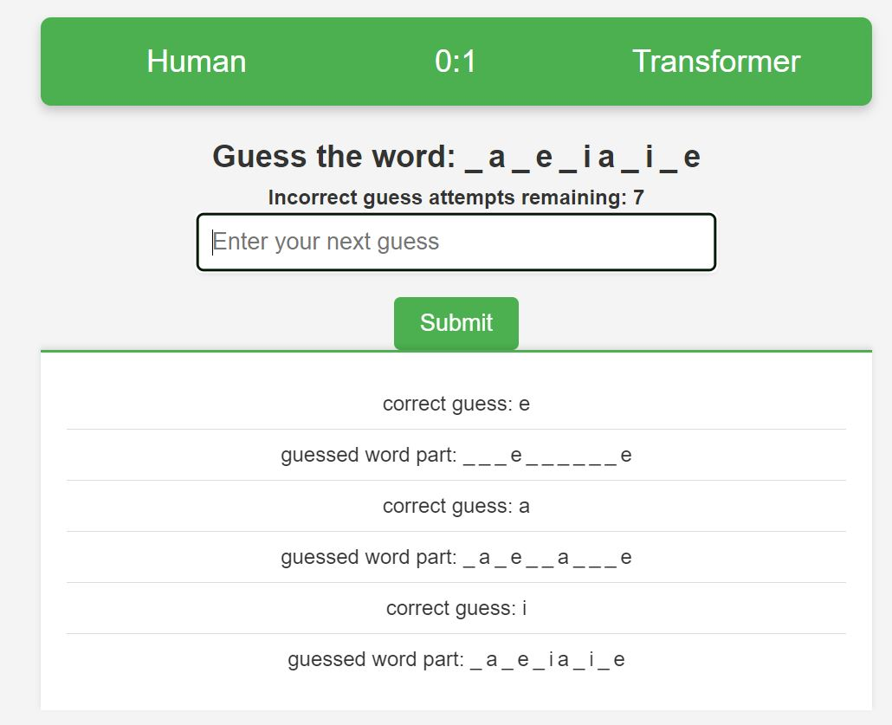
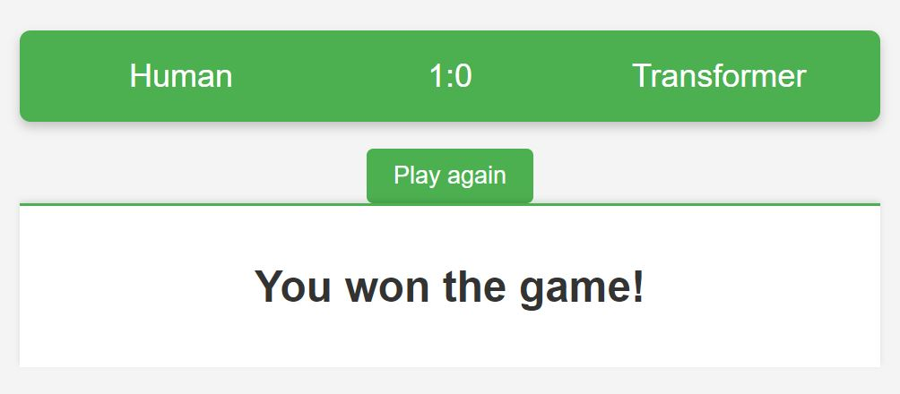

# Hangman Game

This repo contains two main components:
1. Training of the Transformer neural network to play Hangman Game.
2. Flask UI to play againt the trained Transformer.

## Training Module
Hangman Game Transformer mostly follows the standard decoder-only transformer architecture that is described in the GPT papers[[1]](https://cdn.openai.com/better-language-models/language_models_are_unsupervised_multitask_learners.pdf)[[2]](https://papers.nips.cc/paper/2020/file/1457c0d6bfcb4967418bfb8ac142f64a-Paper.pdf). Given the nature of the game, I removed the autoregressive nature of the model. To achieve this, I modified two things: removed the causal self-attention and replaced the prediction of the next token to prediction of the missing token. The removal of the casual self-attention is needed because the transformer has to know the full current state of the word to be able to guess missing letters better. I create every possible state that the word can be for the training data. The words with more unique letters will have more training examples. In my training, I used the uniform sampler, so the longer words are overrepresented in the training process. I tried to use torch's WeightedRandomSampler, but it was too slow, so I skipped this for now. As a result, the transformer has poor performance on short words. 

To train the model from scratch, you will need to download training data. I used an English word dictionary from here: https://github.com/dwyl/english-words. In particular, I use words_alpha, i.e., words that only have letters. You will need a GPU because there are ~844 million training examples, so training on a CPU will be too slow.

## UI Module
I created a simple web interface that has two pages: game creation/settings page and the game page. 

On the game creation page, the player chooses their alias, selects the game mode (only transformer guesses words vs the player guesses the words as well), and chooses the number of points to win. Here is the screenshot of the start page:

On the game page, either you enter a word and see the transformer's guess process or guess a random word yourself.  
Here is the screenshot of the transformer playing screen:

Here is the screenshot of the player playing screen:

The final screen screenshot:

Run app.py for the UI (of course, you will need to install all the dependencies with `pip install -r requirements.txt`).

References:

[1] Radford, A., Wu, J., Child, R., Luan, D., Amodei, D., & Sutskever, I. (2019). Language Models are Unsupervised Multitask Learners.

[2] Brown, T., Mann, B., Ryder, N., Subbiah, M., Kaplan, J., Dhariwal, P., Neelakantan, A., Shyam, P., Sastry, G., Askell, A., Agarwal, S., Herbert-Voss, A., Krueger, G., Henighan, T., Child, R., Ramesh, A., Ziegler, D., Wu, J., Winter, C., Hesse, C., Chen, M., Sigler, E., Litwin, M., Gray, S., Chess, B., Clark, J., Berner, C., McCandlish, S., Radford, A., Sutskever, I., & Amodei, D. (2020). Language Models are Few-Shot Learners. In Advances in Neural Information Processing Systems (pp. 1877–1901). Curran Associates, Inc..